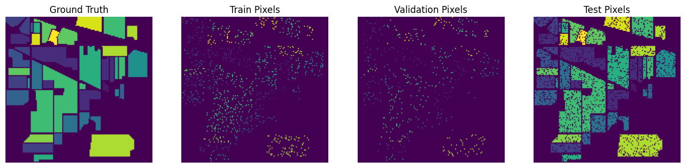

# Two‑Branch Spatial‑Spectral Fusion for Indian Pines Hyperspectral Classification

**Developers:** Sayna Sarvar & [Arman Sajjadi](https://github.com/Armansajjadi)  

[]()
[]()
[]()

---

## 📊 Overview

This repository contains a deep learning framework for **hyperspectral image (HSI) classification** on the **Indian Pines** dataset.  
We propose a **two‑branch architecture** that separately processes **spatial** and **spectral** information, then fuses them with a band‑wise MLP + bidirectional GRU + attention mechanism.

**Key results on the standard test set (90% of labeled pixels):**
- **Overall Accuracy (OA):** 83.74%
- **Average Accuracy (AA):** 77.06%
- **Weighted F1‑Score:** 83.55%

---

## 🧠 Architecture

1. **Spatial Branch** – A modified ResNet‑18 processes each spectral band independently (as a 1‑channel image).  
   Attention pooling compresses band‑wise features into a single vector.  

2. **Spectral Branch** – A 1D CNN / Transformer extracts per‑band spectral features.  
   Outputs a sequence of band‑wise embeddings.

3. **Fusion Module**  
   - **Band‑wise MLP** – concatenates spatial & spectral features per band and projects them.
   - **Bidirectional GRU** – models spectral order dependencies across the 200 bands.
   - **Attention Pooling** – learns which bands are most discriminative.
   - **Classifier** – final fully‑connected layers with heavy dropout.

---

## 📁 Dataset

We use the **Indian Pines** dataset.  
Place the two `.mat` files inside a folder named `Indian_pines/`:

```
Indian_pines/
    Indian_pines_corrected.mat
    Indian_pines_gt.mat
```

The dataset is publicly available from [here](https://www.ehu.eus/ccwintco/index.php/Hyperspectral_Remote_Sensing_Scenes).

---

## 📈 Results

### Confusion Matrix on Test Set


### Data Split Visualization



*Left to right: Ground truth map, training pixels (10%), validation pixels (5%), test pixels (85%).*

---

## ⚠️ Known Issues

- **Class 9** (Oats) has only 17 test samples and currently receives **0 predictions** – this is a known challenge due to extreme class imbalance and spectral similarity with other classes. Future work may focus on targeted data augmentation or few‑shot learning for rare classes.
- The `UndefinedMetricWarning` from sklearn is harmless – it simply indicates that some classes had no predicted samples in the current split.

---

## 📄 References

- Indian Pines dataset: https://www.ehu.eus/ccwintco/index.php/Hyperspectral_Remote_Sensing_Scenes
- Attention‑based fusion for HSI (related work)

---

## 👥 Collaboration

This project was developed as a joint effort by  
**Sayna Sarvar** ([@saynasarvar](https://github.com/saynasarvar))
and  
**Arman Sajjadi** ([@Armansajjadi](https://github.com/Armansajjadi))  

Both authors contributed equally to the design, implementation, and evaluation.
